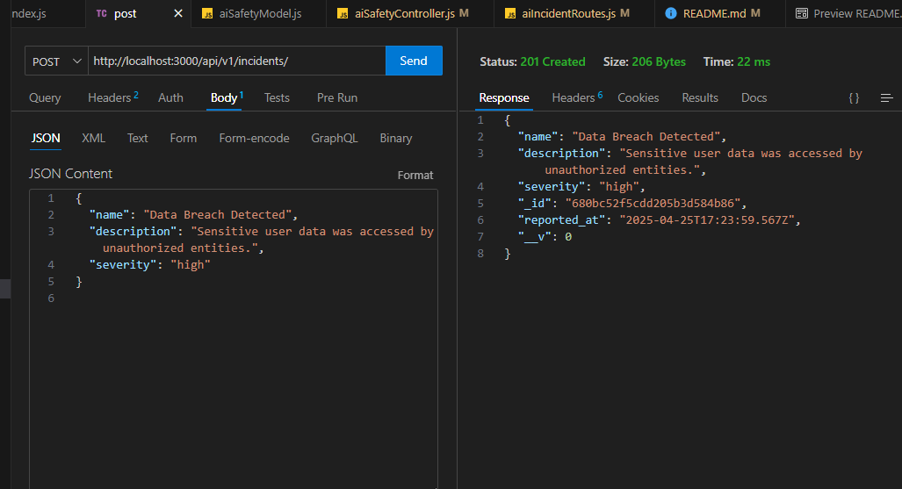
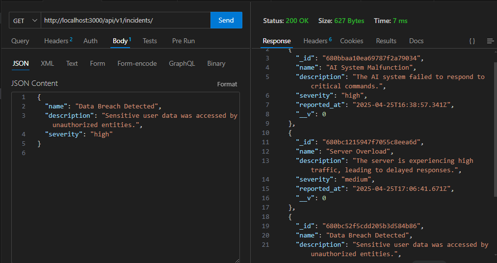
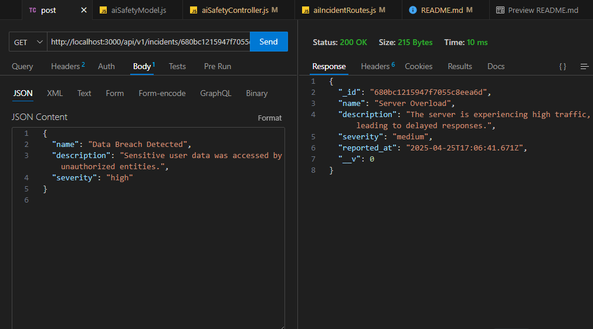
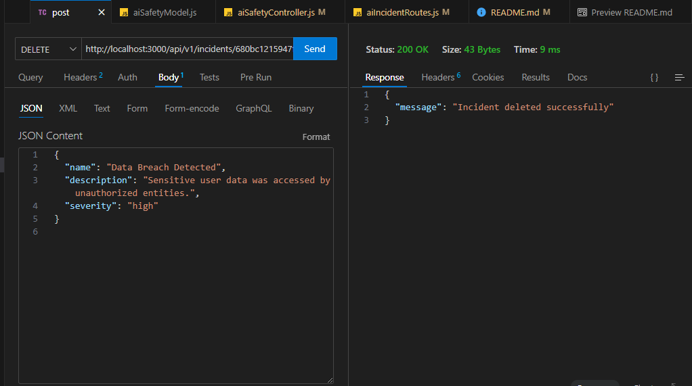

# Sparklehood AI Safety Incident 

## Description
The Sparklehood AI Safety Incident Tracker is a Node.js-based application that allows users to log and manage AI safety incidents. It provides an API to create and track incidents with details such as name, description, severity, and the time of reporting.

## Features
- Log AI safety incidents with detailed descriptions and severity levels (`low`, `medium`, `high`).
- Automatically captures the timestamp of when an incident is reported.
- Provides a RESTful API for seamless integration with other systems.
- Supports CRUD operations for managing incidents efficiently.
- Designed for scalability and ease of use.
- Includes example responses for better understanding of API behavior.
- Securely connects to MongoDB for data storage.
- Environment variable configuration for flexible deployment.
- Comprehensive documentation for developers.

## Installation

1. Clone the repository:
    ```bash
    git clone https://github.com/AyushManyan/sparklehood.git
    cd sparklehood
    ```

2. Install dependencies:
    ```bash
    npm install
    ```

3. Set up the environment variables: Create a `.env` file in the root directory and add the following:
    ```
    MONGO_URI=your_mongodb_connection_string
    PORT=3000
    ```

4. Start the application:
    ```bash
    npm start
    ```

## API Endpoints

### POST /api/v1/incidents
**Description:** Create a new AI safety incident.  
**Request Body:**
```json
{
  "name": "Incident Name",
  "description": "Detailed description of the incident",
  "severity": "low | medium | high"
}
```

**Response:**
- `201 Created`: Returns the created incident.
- `400 Bad Request`: Returns an error message if validation fails.

**Example Result:**
Below is an example image showing the result of this endpoint:




### GET /api/v1/incidents
**Description:** Retrieve all AI safety incidents.  
**Response:**
- `200 OK`: Returns a list of all incidents.
- `500 Internal Server Error`: Returns an error message if something goes wrong.

**Example Result:**
Below is an example image showing the result of this endpoint:




### GET /api/v1/incidents/:id
**Description:** Retrieve a specific AI safety incident by its ID.  
**Path Parameter:**
- `id`: The unique identifier of the incident.

**Response:**
- `200 OK`: Returns the incident details.
- `404 Not Found`: Returns an error message if the incident is not found.
- `500 Internal Server Error`: Returns an error message if something goes wrong.

**Example Result:**
Below is an example image showing the result of this endpoint:




### DELETE /api/v1/incidents/:id
**Description:** Delete a specific AI safety incident by its ID.  
**Path Parameter:**
- `id`: The unique identifier of the incident.

**Response:**
- `200 OK`: Returns a success message upon successful deletion.
- `404 Not Found`: Returns an error message if the incident is not found.
- `500 Internal Server Error`: Returns an error message if something goes wrong.

**Example Result:**
Below is an example image showing the result of this endpoint:




## Technologies Used
- Node.js
- Express.js
- MongoDB